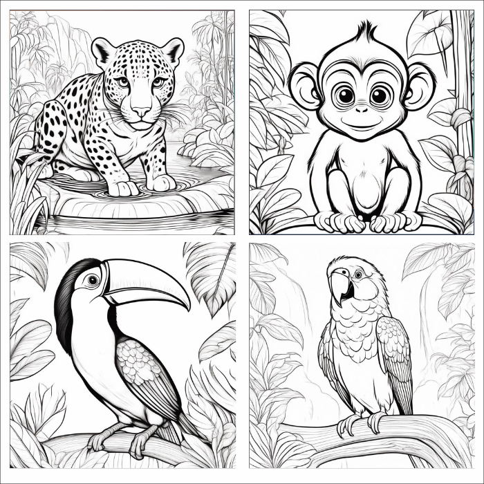

# Ilustrador IA - crie imagens com Inteligência Artificial

## 📒 Descrição
O Ilustrador IA transforma suas ideias em ilustrações cativantes. Descreva seus personagens, escolha estilos e cenas, sem habilidades de desenho necessárias. Explore diversos estilos envolventes. Se o primeiro resultado não agradar, redesenhe ou ajuste facilmente. Liberte sua criatividade agora!

## 🤖 Recursos Principais e tecnologias utilizadas:
<ul>
<li><strong>Geração de ilustrações diversas sem esforço</strong>

Gere ilustrações para o seu livro facilmente descrevendo o que deseja como personagens, estilos e cenas. Sem habilidades de desenho necessárias!

</li>

<li><strong>Gere imagens em altíssima resolução</strong>

Nessa atualização você poderá gerar imagens com alta resolução. Perfeitas para impressão.

</li>

<li><strong>Modelos de IA para gerar excelentes resultados</strong>

Utilizamos atualmente o modelo dalle-3-xl entre outros para proporcionar resultados de imagens altamente detalhadas.

</li>

<li><strong>Use nosso Repositório de Prompt</strong>

Em dúvidas sobre como criar um prompt? Use nossos prompts pensados para ilustração e ilustre lindamente seu livro com o Ilustrador IA!

  
</li>
</ul>

## 🧐 Processo de Criação
Foi elaborado uma inteface amigável usando ReactJS com HTML e CSS. Usamos modelos de IA generativas texto-imagem disponíveis gratuitamente em https://huggingface.co/ para gerar as imagens a partir das entradas de texto do usuário. As imagens geradas podem ser baixadas e utilizadas livremente. 

## 🚀 Resultado
O resultado foi um gerador de imagens por Inteligência Artificial que utiliza modelos generativos para criação de imagens gratuitamente.

## 💭 Reflexão
O Ilustrador IA foi criado para ateder a demanda de autores independentes que tinha dificuldades em gerar imagens usando plataformas mais complexas como Leonardo AI e serviu para treinar a implementação desses modelos generativos usando linguagem JavaScript e não necessariamentente Python como base de construção. 

